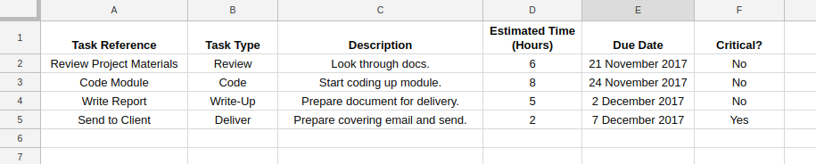
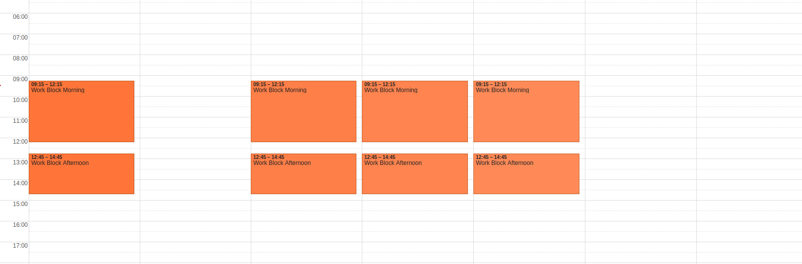

Scheduler
=========

Build status: [](https://travis-ci.org/benhoyle/scheduler)

A little tool for scheduling tasks from a todo list into a calendar.

## Setup Google Sheets and Calendar

Initially the module takes as input tasks defined in a Google sheets document and a calendar of work blocks.

Generate a spreadsheet with the format as shown [here](https://docs.google.com/spreadsheets/d/e/2PACX-1vSFt_kKcoaT235qnJ6ErKjYQv93BGA0qF6Pn6I1x90wWsNWGLrYLnf9JzoxbL7ezr0zjkCfcCsAsuBJ/pubhtml).



This is your todo list.

Then create two Google calendars.
* One of these calendars should be blank. It will receive the scheduled tasks. I call mine "Scheduled Work". This calendar will be cleared so don't add anything important here.
* In the other calendar define a set of work blocks. I do this by adding repeated appointments (e.g. 9-12 and 1-5pm, Monday to Friday). You can then delete individual blocks if you are not working on a particular day.



Make a note of the IDs for the spreadsheet and calendars. The spreadsheet ID can be found in the URL of the spreadsheet:
```
https://docs.google.com/spreadsheets/d/[long string of alphanumeric characters = ID]/edit#gid=0
```
The calendar IDs can be found by clicking the little arrow to the righthand side of the calendar title in the "My Calendars" list in the left-hand-side panel and selecting "Calendar Settings". The calendar ID is then listed in the "Calendar Address" section. It looks like this:
```
(Calendar ID: [long string]@group.calendar.google.com)
```


## Install

Clone the current project on GitHub (I'll upload to PyPi soon).

You can either:
* Create a virtual environment and install the requirements:
```
python3 -m venv /path/to/new/virtual/environment
pip3 install -r requirements.txt
``` or
* Use the Dockerfile in this directory.

Now create a file called ```private.py``` in the top level (project) directory.
In this file add your IDs to the following fields and save:
```
INPUT_CAL_ID = '[Add your input / work blocks calendar ID here]'
OUTPUT_CAL_ID = '[Add your blank output calendar ID here]'

SHEET_ID = '[Add your spreadsheet Id here]'
```

## Setup Google API Access

Follow the quickstart tutorial to setup Google API access [here for sheets](https://developers.google.com/sheets/api/quickstart/python) and [here for calendars](https://developers.google.com/google-apps/calendar/quickstart/python).

(You only need to setup your credentials once for both calendar and sheets.)

Save your ```client_secret.json``` file in the project directory.

On a first run your browser may open (or a link may appear on the command line) to authorise your Google App to access your account. Calendar and sheets credentials josn files are then saved (as ```calendar_creds.json``` and ```sheets_creds.json```).

## Run

Then navigate your terminal to the project directory and run:
```python -m scheduler```.

If everything works your output calendar should now have a set of scheduled events!
